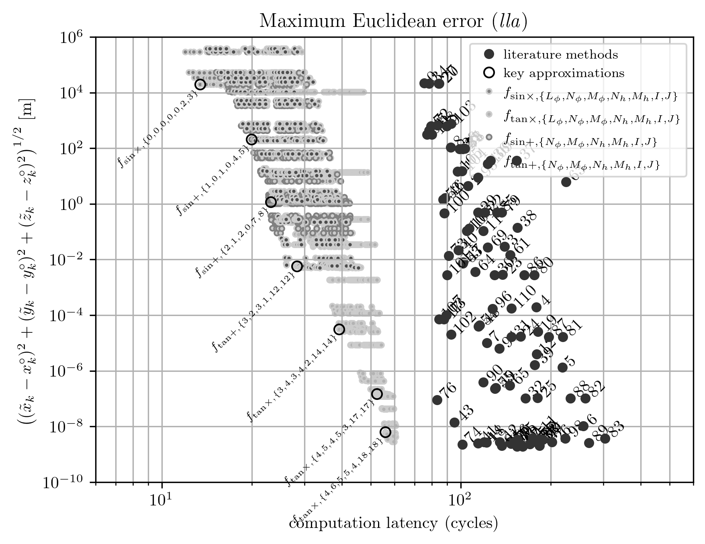
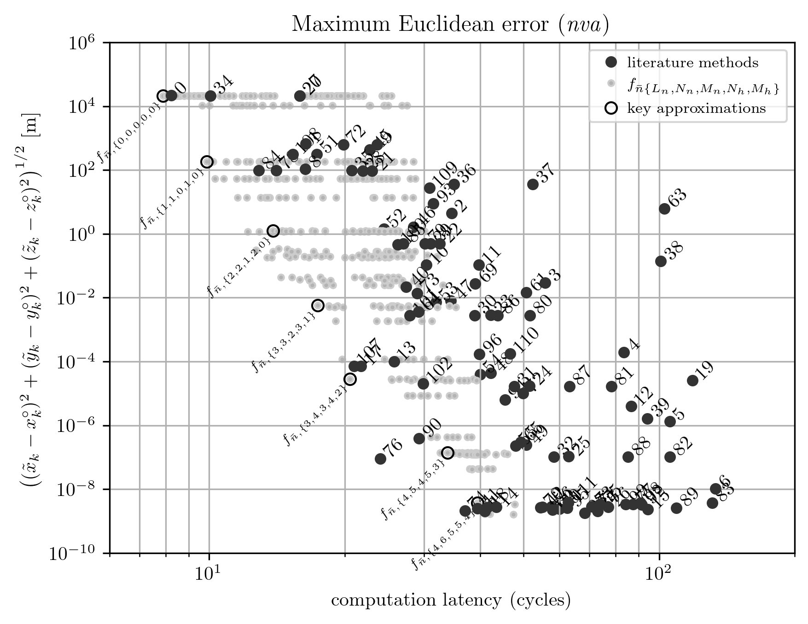

# Minimax polynomial ECEF to geodetic coordinate transformation approximations

This project contains transformation implementations and related coefficient
computations and polynomial evaluation code generation for:

<b>Nilsson, J.-O. Minimax polynomial ECEF to geodetic coordinate transformation 
approximations. doi:
[https://doi.org/10.48550/arXiv.2405.06572](https://doi.org/10.48550/arXiv.2405.06572)
arXiv: 2405.06572 [physics.geo-ph]</b>

<i>Note, a copy of the article is found here in the repo,
[2405.06572v2.pdf](2405.06572v2.pdf).</i>

<i>Note, the presented ECEF to geodetic coordinate transformation are not 
suitable for all use-cases -- no transformation method is! The 
transformation approximations can give you unprecedented performance but are 
only valid for a preselected altitude range. Do study the article to 
understand what the pros and cons are for different methods! Mileage may vary!
</i>

The clock cycle count vs maximum error within the altitude range [-5000,
100000]m for <i>lla</i> (latitude, longitude and altitude) and <i>nva</i> 
(n-vector, altitude) transformations for different polynomial orders (grey), 
i.e. template arguments, and for a large set of methods found in the 
literature (black) are shown below. (Plots adapted, non-vector graphic, from 
the article.) This gives a hint of what is achievable with this project. 
However, again, mileage may vary!



<!---

-->

The transformation implementations are header-only and, together with provided
pregenerated polynomial approximations for the altitude range [-500,100000]m,
they can be used by simply including them. In contrast, the coefficient 
computations and the code generation are provided as three mains which have 
to be linked with multiple other libraries, see dependencies section below. 
The dependencies mean that the code generation essentially requires Unix/Linux.

This project also contains some components of general usefulness such as a 
basic multiprecision Remez algorithm implementation and C-code generation for 
different polynomial evaluation schema, e.g. Estrin, Horner, Horner-2, etc.

## Transformation approximation implementations

The transformation approximation implementations are found in the header 
file [ecef2geo_polynomial.hpp](transformation_implementations/ecef2geo_polynomial.hpp).
The approximations can be used by simply 
including it and specifying polynomial degrees as template arguments. For 
example, a fast and coarse ECEF to geodetic transformation is performed with
```c++
#define _USE_MATH_DEFINES
#include <cmath>  // M_PI
#include <cstdio>  // printf
#include "ecef2geo_polynomial.hpp"
int main() {
    xyz ecef = {-3097120.939, 918384.577, -5491360.698};  // Mount Everest.
    lla geo = ecef2geo::ecef2lla_asina<2,1,2,0,6,8>(ecef);  // Max error ~0.41m.
    printf("%.6f, %.6f, %.1f\n", 180./M_PI*geo.lat, 180./M_PI*geo.lon, geo.alt);
    return 0;
}
```
giving the coordinate of the peak of Mount Everest as
```
 27.986067, 86.922622, 8847.8
```

The algorithm implementations depend on the polynomial approximations generated
by the remainder of the project and found under the generated folder.
Pregenerated code resulting from executing the coefficient calculation
executables as-is is provided, i.e. approximations for the altitude range 
[-500,100000]m. This is so that the implementations are usable without 
getting the more complex coefficient calculations to run.

The user still has to select polynomial orders, i.e. the template arguments,
determining the transformation accuracy and speed. The exact trade-off 
between accuracy and speed and the suitable polynomial orders will be 
application specific. The article contains suitable polynomial order 
combinations minimizing Euclidean errors for accuracies from 10<sup>4</sup> 
to 10<sup>-9</sup> meters. These approximations can also be 
seen as the labeled approximations in the plots above.

## Coefficient computations and polynomial evaluation code generation

The coefficient computations and polynomial approximations (C-code generation)
are provided as three mains:
 1. Trigonometric function polynomial approximation, [main_trigonometric.cpp](coefficient_computations/main_trigonometric.cpp).
 2. Additive correction polynomial approximations, [main_additive.cpp](coefficient_computations/main_additive.cpp).
 3. Multiplicative correction polynomial approximations, [main_multiplicative.cpp](coefficient_computations/main_multiplicative.cpp).

For detailed definitions and descriptions of what is actually being computed, 
see the article.

Note, the information about the actual reference, i.e. WGS 84, is built into 
the coefficients. To use a different reference, e.g. GSR 80, the 
corresponding semi-major axis and flattening of the coefficient calculations 
have to be changed and the coefficients regenerated.

Overall settings are found in settings.hpp and specific settings are found in
the respective main file. The settings which would typically be changed are 
the altitude range limits. Each executable generates a set of files in the 
gen-folder. These files contain the respective polynomial approximations. 
Generating all the approximations, up to polynomial degrees required to 
reach numerical precision, takes order of magnitude 10min.

## Dependencies and requirements

The transformation implementations only depend on the following parts of std:
1. [std::sqrt](https://en.cppreference.com/w/cpp/numeric/math/sqrt)
2. [std::copysign](https://en.cppreference.com/w/cpp/numeric/math/copysign)
3. [std::abs](https://en.cppreference.com/w/cpp/numeric/math/abs)

all of which are found in cmath. Some handling of special cases for very low 
polynomial orders uses [std::enable_if](https://en.cppreference.com/w/cpp/types/enable_if),
which requires C++11. However, this is only for performance for these corner 
cases and can normally be removed which should make the implementations 
compilable with C++98.

The coefficient computations have all kinds of std dependencies and depend 
on the following libraries (license in parenthesis):
1. [MPFR](https://www.mpfr.org/) 4.1 (LGPLv3) Basic multi precision number 
   representation.
2. [MPLAPACK](https://github.com/nakatamaho/mplapack) 2.0.1 (2-clause 
   BSD-style license) Multiprecision linear equation solver for the basic 
   multiprecision Remez algorithm implementation used for computing the 
   additive corrections.
3. [Sollya](https://www.sollya.org/) 8.0 (CeCILL-C) Remez algorithm 
   implementation used for computing the multiplicative corrections and the 
   trigonometric function approximations.
4. [GiNaC](https://www.ginac.de/) 1.8.7 (GPLv2+) Used for final computations 
   of polynomial coefficients from polynomial coefficient expressions. 
5. [CLN](https://www.ginac.de/CLN/) 1.3.6 - Class Library for Numbers (GPLv2+)
    Supporting functionality for GiNaC.
6. [TBB](https://github.com/oneapi-src/oneTBB) - Threading Building Blocks 
   (Apache 2.0) Used for parallel execution of coefficient computations. 
   Only to support the C++17 std::execution::par language feature.

GPLv2+ means GPL version 2 with redistribution possible with any later GPL 
licence, i.e. version 3.

The coefficient computations require C++17. The project has so far only been 
built with gcc on Linux.

## License

The transformation implementations are distributed under the 2-clause BSD 
license.

The coefficient computation code is distributed under GPLv3. Note that this
part is only meant to be used for offline code generation. The GiNaC (and 
CLN) could be worked around, if necessary.

## Contact
jnil02 at kth period se.